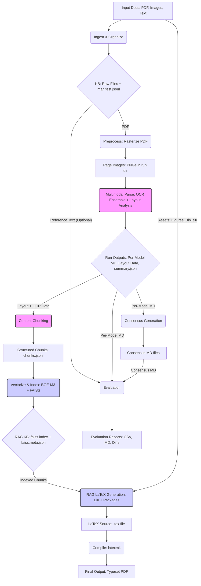

Alright team, let's kick off the **LaTeXify project**\! 🚀

Our goal is ambitious but clear: We're building a **multimodal RAG pipeline** to transform rough drafts – think scanned handwritten notes, typed docs, PDFs, images – into **publication-quality LaTeX documents**. We're not just aiming for basic conversion; we want the output to look like it belongs in a **graduate-level textbook**, leveraging sophisticated LaTeX ecosystems like **LiX** (`lix_textbook`, `lix_article`) and adhering to strict academic conventions.

Think of it as taking messy inputs and producing beautifully typeset, structured academic content automatically.

-----

## Project Scope & Workflow

Here’s a top-down look at the process flow:

1.  **Input Ingestion & Setup**:

      * **Inputs**: Raw draft documents (PDFs, images, maybe text files), potentially assets like figures or BibTeX files. These go into an `inbox` directory.
      * **Process**: The system identifies input files, copies them into a structured knowledge base (KB) directory (e.g., `kb/course/GEN_BASELINE`), categorizing them (syllabus, lectures, assignments) based on filename conventions. A manifest file (`manifest.jsonl`) tracks metadata for each ingested item (source ID, path, hash, type).
      * **Output**: Organized raw files in the KB, updated `manifest.jsonl`.

2.  **Preprocessing & Rasterization**:

      * **Input**: PDF files from the KB.
      * **Process**: PDFs are converted page-by-page into high-resolution PNG images (e.g., 300-400 DPI) using tools like `PyMuPDF` (`fitz`) or `pdftoppm`. These images are saved into a timestamped `run` directory (e.g., `dev/runs/<stamp>/pages/`). Born-digital PDFs might also have plain text extracted directly as a baseline reference.
      * **Output**: A sequence of PNG images, one per page, within the run directory. Plain text per page for reference (optional).

3.  **Multimodal Parsing (OCR Ensemble & Layout Analysis)**:

      * **Input**: Page images (PNGs).
      * **Process**: This is a core step. We run an *ensemble* of different open-source OCR and vision-language models on each page image. Based on the scripts, we're using:
          * **Nanonets OCR2 (3B)**: Emits Markdown + LaTeX.
          * **Nanonets OCR-s**: Also targets Markdown + LaTeX.
          * **Qwen2-VL (2B Instruct)**: Another vision-language model for OCR, instructed to produce Markdown/LaTeX.
          * *(Potentially others like DoTS, PP-OCR, TrOCR, pix2tex, Donut based on setup/scripts)*.
            Each model processes the image and outputs its interpretation, typically as a Markdown file with embedded LaTeX for equations, saved under `dev/runs/<stamp>/outputs/<model_name>/`.
      * **Layout Analysis**: Concurrently (or integrated), models like `HURIDOCS/pdf-document-layout-analysis` identify structural regions (paragraphs, headers, tables, figures, equations) and their bounding boxes on the page images.
      * **Output**: Per-page, per-model Markdown files. Layout region data (labels, bounding boxes) per page. A `summary.json` in the run directory logs the process, files generated, and basic checks.

4.  **Content Structuring & Chunking**:

      * **Input**: OCR model outputs (Markdown files, potentially with bbox data), Layout analysis results.
      * **Process**: The system reads the various OCR outputs for each page. It uses the layout analysis (regions) to assign structural labels (e.g., 'Section-header', 'Formula', 'Text') to the OCR text blocks. If OCR outputs include bounding boxes, it tries to match them to layout regions using Intersection over Union (IoU) or proximity; otherwise, it might use heuristics (like assigning blocks without boxes to the largest region, likely the main text body). This creates structured "chunks" containing text, page number, label, and bounding box.
      * **Output**: A `chunks.jsonl` file in the run directory, where each line represents a structured chunk of content with its metadata.

5.  **Consensus & Evaluation (Quality Check)**:

      * **Input**: Multiple OCR outputs per page (Markdown files), potentially reference text (from born-digital PDFs).
      * **Process**:
          * **Consensus**: A simple consensus mechanism (e.g., choosing the OCR output with median length) generates a single "best" Markdown version per page, saved under `dev/runs/<stamp>/consensus/`.
          * **Evaluation**: If reference text is available, detailed metrics (CER, WER, Levenshtein distance, Jaccard similarity, BLEU-ish score) are computed comparing each model's output (and the consensus) against the reference. Diffs are generated. Issues (high error rates, length mismatches) are summarized.
      * **Output**: Consensus Markdown files per page. `evaluation.csv`, `evaluation_report.md`, `issues_summary.json`, and detailed diff files in `dev/runs/<stamp>/diffs/`.

6.  **Vectorization & Indexing (RAG KB Creation)**:

      * **Input**: The structured `chunks.jsonl` file.
      * **Process**: The text content of each chunk is embedded into a vector representation using a sentence-transformer model (specifically BGE-M3 mentioned). These vectors are normalized and stored in a FAISS index (using IndexFlatIP for cosine similarity). The metadata for each chunk (ID, page, label, bbox) is stored separately, linked by the index position.
      * **Output**: A `faiss.index` file and a `faiss.meta.json` file in the run directory, forming the searchable RAG knowledge base for this document.

7.  **RAG-based LaTeX Generation**:

      * **Input**: The indexed chunks (FAISS index + metadata), potentially user queries or directives, context from the project repo (e.g., existing macros, style guides inferred via RAG).
      * **Process**: This stage (likely orchestrated by the LangGraph pipeline mentioned in `README.dev.md`) involves:
          * **Retrieval**: Querying the FAISS index to find relevant chunks based on semantic similarity or structural queries.
          * **Synthesis**: An LLM uses the retrieved chunks, the overall document structure plan (potentially derived from layout analysis or a planning step), and knowledge of LaTeX best practices (especially LiX classes and recommended packages like `thmtools`, `cleveref`, `minted`) to generate the final LaTeX source code. It needs to handle theorem environments, cross-referencing, code blocks, figures, tables, and citations according to the determined style. A "Style Arbiter" might analyze the input/repo to choose the citation style (APA, IEEE, etc.). Uncertainties are flagged with `\todo{}` comments.
      * **Output**: A main `.tex` file (e.g., `outputs/GEN_BASELINE/main.tex`) and potentially supporting files (like a `.bib` file if references were processed).

8.  **Compilation & Final Output**:

      * **Input**: The generated `.tex` file(s).
      * **Process**: A LaTeX compiler (like `latexmk`) is used to compile the `.tex` file into a PDF. This requires the necessary LaTeX distribution (e.g., TeX Live) and potentially external tools like Pygments for `minted` code highlighting (requiring the `-shell-escape` flag).
      * **Output**: The final, typeset PDF document ready for review.

-----

## Data Flow Chart

Here’s a simplified text representation of the data flow:

**Key Stages in Flowchart:**

  * **(Pink)** Parsing/Structuring Steps
  * **(Blue)** RAG/Generation Steps

-----

This pipeline heavily relies on robust open-source models for parsing and leverages a RAG approach to ensure the final LaTeX output is contextually accurate, well-structured, and adheres to high academic typesetting standards using the LiX framework. Our focus is on quality, readability, and leveraging the best of modern LaTeX practices. Let's get started\! 💪
