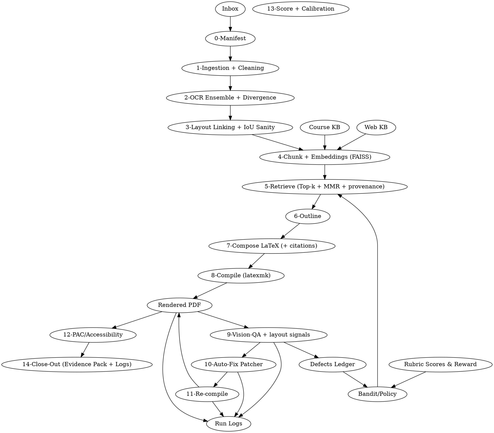

# A) Stage-Gated Build Plan (Chronological)

**Tunable MSC thresholds (all quick, sample-based):**
`CER_target=0.05 • WER_target=0.08 • OCR_len_divergence=±15% • Layout_IoU=[0.5,0.9] • Orphan_boxes=0 • P@k≥0.7 (k=5 on toy gold) • MMR_lambda∈[0.2,0.5] improves diversity ≥10% vs. baseline • Compile exit=0 • UndefinedRefs=0 • PageDrift≤±10% vs. outline • VQA: blocked=0 on sample, captions≥95% for figures, contrast pass on sample (WCAG AA) • Auto-Fix reduces defect_count ≥20% and never increases compile errors • PAC: required PDF/UA checks pass • Calibration improves self-consistency ≥5% without regressing P@k.`

| ID                     | Stage Goal                       | Minimal Steps                                                                                                                                                                                                                          | Micro Sanity Check (MSC)                                                                                                 | Artifacts to Save                                                          | Go/No-Go Criteria                                                                  | Next Step                                                            |                    |
| ---------------------- | -------------------------------- | -------------------------------------------------------------------------------------------------------------------------------------------------------------------------------------------------------------------------------------- | ------------------------------------------------------------------------------------------------------------------------ | -------------------------------------------------------------------------- | ---------------------------------------------------------------------------------- | -------------------------------------------------------------------- | ------------------ |
| **0-Manifest**         | Register input & basic integrity | 1) Read file; 2) Compute SHA-256 & size; 3) Sniff MIME; 4) If image-only, note rasterization fallback                                                                                                                                  | hash present; size ∈ (1 KB, 1 GB); MIME ∈ {pdf, docx, md, html, png, jpg, txt}; 100% pass                                | `manifest.json` (name, size, sha256, mime, pages_if_known)                 | **Go** if all checks pass; else **No-Go** with reason                              | **1-Ingestion**                                                      |                    |
| **1-Ingestion**        | Normalize & preprocess           | 1) Convert to PDF (pandoc/office→pdf); 2) Split pages; 3) For vector+image PDFs keep both; 4) Rasterization fallback (300 dpi)                                                                                                         | page count >0; per-page image bytes sane; file openable; integrity hash per page                                         | `ingest_report.json`, `pages/pg_*.pdf                                      | png`, `page_hashes.json`                                                           | **Go** if ≥99% pages readable (OK to quarantine ≤1%); else **No-Go** | **2-OCR-Ensemble** |
| **2-OCR-Ensemble**     | Extract text robustly            | 1) Run **born-digital** extractor (pdfminer/pymupdf); 2) Run OCR ensemble (e.g., tesseract + paddle + docTR) on raster; 3) Align by region; 4) Compute CER/WER & divergence; 5) Outlier rejection; 6) Choose consensus or born-digital | CER≤`CER_target`; WER≤`WER_target`; ensemble lengths within `±15%`; choose born-digital if it beats OCR by ≥3× lower CER | `ocr/ocr_*.json`, `ocr_consensus.json`, `ocr_qc.json`                      | **Go** if metrics pass OR if born-digital valid; else **No-Go** with flagged pages | **3-Layout-Link**                                                    |                    |
| **3-Layout-Link**      | Map text to layout order         | 1) Detect blocks/lines/figures/tables; 2) Link OCR spans→boxes; 3) Enforce reading order; 4) Validate IoU & orphans                                                                                                                    | IoU in `[0.5,0.9]` for ≥95% links; reading order monotonic; **0** orphan boxes                                           | `layout.json` (boxes, links, order), `layout_qc.json`                      | **Go** if all layout MSCs pass; else **No-Go**                                     | **4-Chunk-Embed**                                                    |                    |
| **4-Chunk-Embed**      | Build searchable index           | 1) Parent-child chunking (parent=section, child≈512-1k chars); 2) Normalize text (lower, Unicode NFC); 3) Compute **BGE-M3** embeddings; 4) Build FAISS; 5) Store metadata (page, section, figure IDs)                                 | Embedding count = child chunk count; FAISS train OK; sample nearest-neighbor sanity (same section)                       | `chunks.jsonl`, `parent_child_map.json`, `faiss.index`, `embed_stats.json` | **Go** if no NaNs & NN sanity passes; else **No-Go**                               | **5-Retrieve**                                                       |                    |
| **5-Retrieve**         | Validate retrieval quality       | 1) Define tiny gold (5-20 Q/A or Q→doc ids); 2) Retrieve with Top-k & **MMR** λ∈[0.2,0.5]; 3) Apply metadata filters (doc/page/section); 4) Compare P@k & diversity vs. baseline                                                       | P@k (k=5) ≥0.7 on toy gold; MMR set beats baseline diversity by ≥10% unique parents                                      | `retrieval_eval.json`, `search_params.json`                                | **Go** if both P@k and diversity pass; else **No-Go**                              | **6-Outline**                                                        |                    |
| **6-Outline**          | Produce outline/skeleton         | 1) Plan sections from retrieval context; 2) Decide figures/tables refs; 3) Map to parent chunks                                                                                                                                        | Outline covers ≥90% major headings (sanity: compare to TOC/headers); counts match expected sections                      | `outline.md`, `outline_qc.json`                                            | **Go** if coverage ≥90% & no missing critical sections; else **No-Go**             | **7-Compose-LaTeX**                                                  |                    |
| **7-Compose-LaTeX**    | Synthesize strict LaTeX          | 1) Use **preamble allowlist** only (e.g., `article`, `amsmath`, `graphicx`, `hyperref`, `cleveref`); 2) Insert citations/provenance in footnotes; 3) Any uncertainty → `\todo{…}`; 4) Math check with symbolic/syntax guard            | Lint (chktex) ≤5 warnings; no banned packages; equation envs balanced; all figs/tables referenced                        | `draft.tex`, `preamble_policy.json`, `latex_lint.json`                     | **Go** if lint & policy pass; else **No-Go**                                       | **8-Compile**                                                        |                    |
| **8-Compile**          | Produce PDF                      | 1) `latexmk -pdf -interaction=nonstopmode`; 2) Parse log; 3) Page count sanity vs. outline                                                                                                                                             | exit code=0; **Undefined references=0**; pages within ±10% vs. outline; no “Missing $ inserted”                          | `build/compile.log`, `build/out.pdf`                                       | **Go** if all compile MSCs pass; else **No-Go**                                    | **9-Vision-QA**                                                      |                    |
| **9-Vision-QA**        | Visual quality & layout QA       | 1) Render pages to images; 2) Vision probes: blocked/overlaps, figure/table presence, caption detection, contrast; 3) Spot check 3 pages                                                                                               | No blocked elements on sample; captions present for ≥95% figures; sample contrast WCAG AA                                | `vqa_report.json`, `page_thumbs/`                                          | **Go** if VQA passes; else **No-Go**                                               | **10-Auto-Fix**                                                      |                    |
| **10-Auto-Fix**        | Patch LaTeX to fix defects       | 1) Generate minimal diffs for each defect; 2) Apply patch; 3) Update defect ledger                                                                                                                                                     | After patch: defect_count ↓ ≥20%; no new compile errors; diffs minimal                                                   | `patch.diff`, `defects_ledger.json` (append), `fix_log.json`               | **Go** if improved & stable; else **No-Go**                                        | **11-Recompile**                                                     |                    |
| **11-Recompile**       | Verify fixes                     | 1) Re-run 8-Compile; 2) Re-run 9-Vision-QA on changed pages                                                                                                                                                                            | Compile still exit=0; VQA now passes previously failing checks                                                           | `build/compile2.log`, `vqa_report2.json`, `out_v2.pdf`                     | **Go** if both pass; else **No-Go** (loop back to 10)                              | **12-PAC-Access**                                                    |                    |
| **12-PAC-Access**      | Accessibility gate               | 1) Run PAC or pdfua checker; 2) Ensure tags, alt text, reading order, headings                                                                                                                                                         | Required PDF/UA rules pass (tags, alt text for all figures/tables, lang set, bookmarks)                                  | `pac_report.json`, `tag_tree.json`                                         | **Go** if required rules pass; else **No-Go** (back to 10)                         | **13-Score-Calibrate**                                               |                    |
| **13-Score-Calibrate** | Calibrate & log metrics          | 1) Self-consistency (n=3) on key prompts; 2) Temperature scaling; 3) Bandit choose (k, λ) that maximizes validation                                                                                                                    | Self-consistency ↑ ≥5%; chosen policy doesn’t regress P@k/diversity                                                      | `scorecard.json`, `calibration.json`, `policy.json`                        | **Go** if improvement; else **No-Go** (restore last best)                          | **14-Close-Out**                                                     |                    |
| **14-Close-Out**       | Seal artifacts & logs            | 1) Bundle evidence pack; 2) Write run log summary; 3) Tag release                                                                                                                                                                      | Evidence pack present; run log complete; checksums recorded                                                              | `evidence_pack.zip`, `run.log`, `checksums.txt`                            | **Go** = Done                                                                      | —                                                                    |                    |

---

## Defect Classes & Thresholds (fail a gate if any trip)

* **Manifest/Ingress:** corrupt file; MIME not whitelisted; unreadable pages >1%.
* **OCR:** CER>`CER_target` or WER>`WER_target`; ensemble divergence >`±15%`; outliers >5% pages; consensus missing.
* **Layout:** IoU outside `[0.5,0.9]` for >5% links; non-monotonic reading order; orphan boxes >0.
* **Retrieval:** P@5<0.7 on toy gold; MMR diversity gain <10%.
* **LaTeX Policy:** banned package used; equations unbalanced; unresolved citations/refs.
* **Compile:** exit≠0; undefined refs>0; page drift >±10%.
* **Vision-QA:** blocked/overlapping elements detected; missing captions >5%; low contrast on sample pages.
* **Auto-Fix:** patch increases defect count or introduces new compile errors.
* **PAC:** required PDF/UA checks fail (tags, alt text, document language, outline).
* **Calibration:** regression on P@k or diversity vs. last best.

---

## Evidence Pack (what to save per stage)

`/artifacts/`
0: `manifest.json` • 1: `ingest_report.json`, `page_hashes.json` • 2: `ocr/*.json`, `ocr_qc.json` • 3: `layout.json`, `layout_qc.json` •
4: `chunks.jsonl`, `parent_child_map.json`, `faiss.index`, `embed_stats.json` • 5: `retrieval_eval.json`, `search_params.json` •
6: `outline.md`, `outline_qc.json` • 7: `draft.tex`, `preamble_policy.json`, `latex_lint.json` •
8: `build/out.pdf`, `build/compile.log` • 9: `vqa_report.json`, `page_thumbs/` • 10: `patch.diff`, `defects_ledger.json`, `fix_log.json` •
11: `build/compile2.log`, `vqa_report2.json`, `out_v2.pdf` • 12: `pac_report.json`, `tag_tree.json` •
13: `scorecard.json`, `calibration.json`, `policy.json` • 14: `evidence_pack.zip`, `run.log`, `checksums.txt`.

---

## Operator Prompts (use when blocked)

* **0-Manifest:** “Check why MIME/hash/size fails for *{file}*. Suggest a safe conversion or rejection reason.”
* **1-Ingestion:** “Page {n} failed to rasterize. Propose parameters or tools to convert to PDF at 300 dpi.”
* **2-OCR-Ensemble:** “CER/WER too high on pages {…}. Recommend per-page engine and language hints; show diffs.”
* **3-Layout-Link:** “IoU/order failing on {pages}. Suggest block detector thresholds and ordering heuristics.”
* **4-Chunk-Embed:** “Parent-child chunking off. Propose boundaries and normalization steps for {sample text}.”
* **5-Retrieve:** “P@5={x}. Tune k, λ, filters; propose 3 param sets with expected trade-offs.”
* **6-Outline:** “Outline misses {sections}. Suggest a minimal outline patch with anchors.”
* **7-Compose-LaTeX:** “Flag banned packages/usages; rewrite snippet to allowed preamble; replace uncertain math with \todo{}.”
* **8-Compile:** “Parse compile.log for root cause and propose minimal LaTeX fix.”
* **9-Vision-QA:** “Identify blocked elements/low contrast on {pages}; give LaTeX diffs to fix.”
* **10-Auto-Fix:** “Generate minimal patch diff for defects {…}; ensure no new warnings.”
* **11-Recompile:** “Compare v1 vs v2 PDFs; confirm defects resolved; list residuals.”
* **12-PAC-Access:** “List failing PDF/UA rules and show exact LaTeX tagging/alt-text changes.”
* **13-Score-Calibrate:** “Run self-consistency & temperature scaling; produce before/after metrics and pick policy.”
* **14-Close-Out:** “Assemble evidence_pack.zip manifest and checksums; verify completeness.”

---

# B) Runbook (Solo-Builder Friendly)

Below are minimal, copy-paste actions. Replace paths as needed. Expected outputs are 1-line checks. If fail, do the next action.

**0-Manifest**

* **Cmd:** `python tools/manifest.py --in inbox/doc.pdf --out artifacts/manifest.json`
* **Pass looks like:** `OK mime=application/pdf sha256=<…> size=2.1MB`
* **If fail:** `file --mime-type inbox/doc.pdf` then `qpdf --linearize inbox/doc.pdf tmp.pdf && mv tmp.pdf inbox/doc.pdf`

**1-Ingestion**

* **Cmd:** `python tools/ingest.py --in inbox/doc.pdf --out artifacts/pages --dpi 300`
* **Pass:** `pages=12 readable=12/12`
* **If fail:** `pdftoppm -r 300 inbox/doc.pdf artifacts/pages/pg -png`

**2-OCR-Ensemble**

* **Cmd:** `python tools/ocr_ensemble.py --pages artifacts/pages --out artifacts/ocr`
* **Pass:** `CER=0.03 WER=0.06 consensus=born-digital`
* **If fail:** `python tools/ocr_ensemble.py --lang en --engine tesseract,paddle,doctr --page 3 --tune`

**3-Layout-Link**

* **Cmd:** `python tools/layout_link.py --ocr artifacts/ocr --pdf inbox/doc.pdf --out artifacts/layout.json`
* **Pass:** `IoU_p95=0.78 orphans=0 order=monotonic`
* **If fail:** `python tools/layout_link.py --min_iou 0.55 --merge_lines true --fix_orphans`

**4-Chunk-Embed**

* **Cmd:** `python tools/chunk_embed.py --layout artifacts/layout.json --out artifacts --model bge-m3`
* **Pass:** `chunks=420 parents=38 faiss.train=OK`
* **If fail:** `python tools/chunk_embed.py --child_len 800 --overlap 100 --normalize true`

**5-Retrieve**

* **Cmd:** `python tools/retrieve_eval.py --faiss artifacts/faiss.index --gold eval/gold_tiny.json --k 5 --mmr 0.4`
* **Pass:** `P@5=0.74 diversity=+12%`
* **If fail:** rerun with `--k 8 --mmr 0.3 --filter section` and pick best.

**6-Outline**

* **Cmd:** `python tools/outline.py --chunks artifacts/chunks.jsonl --out artifacts/outline.md`
* **Pass:** `coverage=92% sections=7`
* **If fail:** `python tools/outline.py --seed_from headers --force_sections Introduction,Methods,Results,Discussion`

**7-Compose-LaTeX**

* **Cmd:** `python tools/compose_tex.py --outline artifacts/outline.md --faiss artifacts/faiss.index --out artifacts/draft.tex --policy policies/preamble_allowlist.json`
* **Pass:** `lint: 3 warnings; banned: 0; todos: 2`
* **If fail:** `python tools/compose_tex.py --strip_packages "titlesec,geometry"` (or ask prompt above)

**8-Compile**

* **Cmd:** `latexmk -pdf -interaction=nonstopmode -outdir=build artifacts/draft.tex && python tools/compile_qc.py build/compile.log build/out.pdf artifacts/outline.md`
* **Pass:** `exit=0 undefined=0 page_drift=+4%`
* **If fail:** `texfot pdflatex artifacts/draft.tex` to isolate; fix offending section.

**9-Vision-QA**

* **Cmd:** `python tools/vqa.py --pdf build/out.pdf --out artifacts/vqa_report.json --sample 3`
* **Pass:** `blocked=0 captions=100% contrast=pass`
* **If fail:** `python tools/vqa.py --explain --pages 3,7,9`

**10-Auto-Fix**

* **Cmd:** `python tools/autofix.py --defects artifacts/vqa_report.json --tex artifacts/draft.tex --out artifacts/patch.diff`
* **Pass:** `defects:-6 new_compile_errors:0`
* **If fail:** `git apply --reject artifacts/patch.diff && inspect .rej`

**11-Recompile**

* **Cmd:** repeat **8** and **9** on changed pages.
* **Pass:** `exit=0; defects now 0`
* **If fail:** loop to **10**.

**12-PAC-Access**

* **Cmd:** `python tools/pac_wrap.py --pdf build/out.pdf --out artifacts/pac_report.json`
* **Pass:** `pdfua_required: PASS`
* **If fail:** `python tools/pac_fix.py --tex artifacts/draft.tex --add_alt --tag_headings`

**13-Score-Calibrate**

* **Cmd:** `python tools/calibrate.py --faiss artifacts/faiss.index --gold eval/gold_tiny.json --out artifacts/policy.json`
* **Pass:** `self_consistency:+6% P@5:hold`
* **If fail:** revert to last `policy.json`.

**14-Close-Out**

* **Cmd:** `python tools/pack.py --root artifacts --pdf build/out.pdf --out artifacts/evidence_pack.zip && sha256sum artifacts/evidence_pack.zip > artifacts/checksums.txt`
* **Pass:** `evidence_pack.zip created (N files)`
* **If fail:** list missing required artifacts printed by packer.

---

# C) Flowchart (non-broken)

### 1) Mermaid

```mermaid
flowchart TB
  Inbox[Inbox]
  CourseKB[Course KB]
  WebKB[Web KB]
  Manifest[0-Manifest]
  Ingest[1-Ingestion + Cleaning]
  OCR[2-OCR Ensemble + Divergence]
  Layout[3-Layout Linking + IoU Sanity]
  Embed[4-Chunk + Embeddings (FAISS)]
  Retrieve[5-Retrieve (Top-k + MMR + provenance)]
  Outline[6-Outline]
  Compose[7-Compose LaTeX (+ citations)]
  Compile[8-Compile (latexmk)]
  PDF[Rendered PDF]
  VQA[9-Vision-QA + layout signals]
  AutoFix[10-Auto-Fix Patcher]
  Recompile[11-Re-compile]
  PAC[12-PAC/Accessibility]
  Score[13-Score + Calibration]
  Close[14-Close-Out (Evidence Pack + Logs)]
  Rubric[Rubric Scores & Reward]
  Bandit[Bandit/Policy]
  Defects[Defects Ledger]
  Logs[Run Logs]

  Inbox --> Manifest
  CourseKB --> Embed
  WebKB --> Embed
  Manifest --> Ingest --> OCR --> Layout --> Embed --> Retrieve --> Outline --> Compose --> Compile --> PDF --> VQA --> AutoFix --> Recompile --> PDF
  PDF --> PAC --> Close
  VQA --> Defects --> Bandit --> Retrieve
  Rubric --> Bandit
  PDF --> Logs
  VQA --> Logs
  AutoFix --> Logs
  Recompile --> Logs
```

### 2) Graphviz DOT (fallback)



### 3) Walkthrough (plain English)

Content arrives in **Inbox**, gets validated in **0-Manifest**, and normalized in **1-Ingestion**. Text is extracted either via born-digital parsing or an OCR **ensemble** in **2**, then aligned to page layout with IoU/order checks in **3**. We chunk and embed into FAISS in **4**, then test retrieval quality with MMR and a tiny gold set in **5**. A lean **6-Outline** guides **7-Compose-LaTeX** under a strict preamble policy, producing a draft that compiles in **8**. The **Rendered PDF** is probed by **9-Vision-QA**; any defects are logged and patched in **10-Auto-Fix**, recompiled in **11**, and re-checked. Accessibility is enforced in **12-PAC**. **13-Score/Calibration** tunes retrieval/decoding policy (bandit), with signals also feeding back from **Rubric** and **Defects** to **Bandit**, which can adjust **Retrieve**. Throughout, **Logs** collect events from PDF, VQA, AutoFix, and Recompile. **14-Close-Out** bundles the evidence pack and checksums.

---

# D) Minimal Evaluation Kit (tiny, inline)

**`manifest.json` (schema & example)**

```json
{
  "file_name": "doc.pdf",
  "sha256": "4f1c...ab",
  "size_bytes": 2193840,
  "mime": "application/pdf",
  "pages_expected": 12
}
```

**OCR result envelope (`ocr_consensus.json`)**

```json
{
  "page_id": 3,
  "sources": [
    {"engine": "born_digital", "cer": 0.012, "wer": 0.034, "len": 1420},
    {"engine": "tesseract", "cer": 0.041, "wer": 0.089, "len": 1530},
    {"engine": "paddle", "cer": 0.035, "wer": 0.077, "len": 1498}
  ],
  "consensus_text_md5": "f0e1d2...",
  "winner": "born_digital",
  "divergence_pass": true
}
```

**VQA defect record (`vqa_report.json` item)**

```json
{
  "page": 7,
  "defects": [
    {"type": "blocked_element", "bbox": [120, 430, 240, 470], "confidence": 0.93},
    {"type": "missing_caption", "figure_id": "fig-3"}
  ],
  "contrast_sample": {"status": "pass", "method": "WCAG-AA"}
}
```

**PAC summary (`pac_report.json`)**

```json
{
  "pdfua_required": "PASS",
  "checks": {
    "tags_present": true,
    "alt_text_coverage": 1.0,
    "document_language": "en-US",
    "bookmarks_outline": true,
    "reading_order_valid": true
  },
  "violations": []
}
```

---

# E) Operating Principles

* **Gate-driven**: no dates; progress only when MSCs pass.
* **Fast checks**: each MSC runs on a tiny sample (≤30s) and is deterministic.
* **Minimal moving parts**: single-file artifacts per stage, strict preamble allowlist, local FAISS index.
* **Defensive defaults**: rasterization fallback, OCR ensemble with consensus, layout IoU/order checks, robust structured logging at page/model/file levels.
* **Traceability**: every decision produces a persistent artifact in the evidence pack.
* **Accessibility is non-negotiable**: PAC required rules must pass before Close-Out.

---

### Notes for the Solo Builder

* You can keep this entire pipeline as a single `./tools/` folder with one Python per stage and a shared `./artifacts/` directory.
* If you want to bootstrap quickly, the LaTeX composition stage can borrow structure ideas from repositories like *LaTeXify* (strict preamble and math blocks), but still enforce your **preamble allowlist** and `\todo{}` policy here.
* For embeddings, **BGE-M3** + FAISS IVFFlat is sufficient for the tiny gold evaluation and MMR.
* The **orchestration loop** is simply: **Plan → Retrieve → Compose → Compile → Vision-QA → Auto-Fix → Re-compile → Score/Calibrate → Log/Defects**, already reflected in stages and edges.
